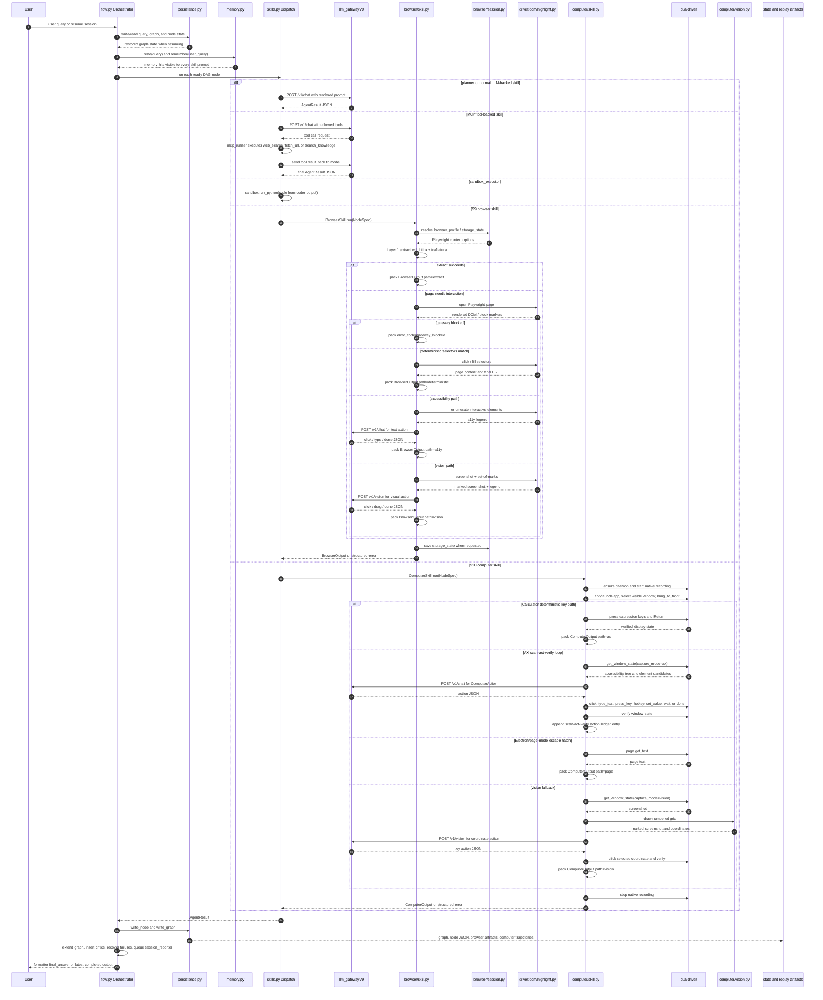

# Session 9 Assignment: Browser Agent Modules

This folder is the Session 9 assignment copy of `S9SharedCode/`. The original
shared code folder is intentionally untouched. Session 9 keeps the Session 8
multi-agent DAG runtime and adds a Browser skill that can fetch, interact with,
and visually inspect web pages through a cost-disciplined cascade.

## What S9 Adds

| Area | Module / File | Purpose |
|---|---|---|
| Browser skill entry | `code/agent_config.yaml` | Registers `browser` as a normal skill in the catalogue. |
| Browser prompt | `code/prompts/browser.md` | Documents browser inputs, outputs, session metadata, and gateway-block behavior. |
| Planner routing rules | `code/prompts/planner.md` | Tells the Planner when to use Browser instead of static Researcher fetches. |
| Browser dispatch | `code/skills.py` | Adds the `browser` dispatch branch that calls `BrowserSkill.run(...)`. |
| Browser output schema | `code/schemas.py` | Adds `BrowserOutput` fields and structured `error_code` values. |
| Cascade wrapper | `code/browser/skill.py` | Owns the four-layer cascade and packs results into `AgentResult`. |
| Gateway client | `code/browser/client.py` | Calls V9 `/v1/chat`, `/v1/vision`, and cost-ledger endpoints. |
| DOM/a11y enumeration | `code/browser/dom.py` | Finds visible interactive elements and creates text legends. |
| A11y and vision drivers | `code/browser/driver.py` | Runs the turn loop for Layer 2b and Layer 3 browser actions. |
| Set-of-marks | `code/browser/highlight.py` | Draws numbered boxes on screenshots for vision-model selection. |
| Session persistence | `code/browser/session.py` | Loads/saves Playwright storage state and persistent browser profiles. |
| Browser validation | `code/tests/test_browser_assignment_features.py` | Tests profile metadata, block detection, and replay-visible output fields. |
| Provider routing | `code/provider_routing.py` | Lets LLM-backed skills choose Nvidia/Groq/Cerebras/Gemini from live V9 worker status before each call. |
| Assignment notes | `ASSIGNMENT_9.md` | Short checklist of assignment requirements and implementation locations. |
| Full module map | `code/MODULE_MAP.md` | Detailed runtime map, data models, and component interaction diagrams. |

## Browser Cascade

The Browser skill tries the cheapest path first and escalates only when the
current layer cannot satisfy the goal.

| Layer | Implementation | Cost Shape |
|---|---|---|
| Layer 1: extract | `httpx` + `trafilatura` in `browser/skill.py` | No browser, no LLM call |
| Layer 2a: deterministic | Caller-supplied `metadata.selectors` | Browser, no LLM call |
| Layer 2b: a11y | Playwright + text legend + `/v1/chat` | Cheap text LLM call |
| Layer 3: vision | Playwright + set-of-marks screenshot + `/v1/vision` | Vision-model call |
| Precondition failure | `detect_gateway_block(...)` | Returns `error_code="gateway_blocked"` |

Precondition failures include CAPTCHA, login walls, geo blocks, rate limits,
and access-denied pages. These are surfaced as structured failures so the
Planner can route around them instead of retrying the same blocked URL.

## Browser Metadata

Browser nodes use `metadata.url` and `metadata.goal`. The assignment copy also
supports browser session metadata:

```json
{
  "url": "https://example.com/account",
  "goal": "Open the account page and extract the visible plan name.",
  "browser_profile": "example_logged_in",
  "storage_state": "state/browser_profiles/example_logged_in.json",
  "save_storage_state": "state/browser_profiles/example_logged_in.json",
  "user_data_dir": "state/browser_profiles/example_chrome",
  "headless": true
}
```

`browser_profile` is the easiest reusable option. It maps to
`code/state/browser_profiles/<profile>.json`. Use `headless=false` only for an
explicit manual-login bootstrap run.

## Visible Browser Actions

Assignment 9 requires at least three visible browser actions. Passive scraping
from search snippets is not accepted. In this implementation, visible actions
are the Playwright actions recorded by Layer 2a, Layer 2b, or Layer 3, for
example:

| Action type | Where it is recorded |
|---|---|
| Search or submit a form | `BrowserOutput.actions[*].actions` with `fill`, `key`, or `click` |
| Filter or sort results | `BrowserOutput.actions[*].actions` with the clicked control and outcome |
| Open product/detail pages | `BrowserOutput.final_url` plus click actions in the action ledger |
| Switch/expand/scroll content | `BrowserOutput.actions[*].actions` with `click`, `scroll`, or `wait` |
| Vision/set-of-marks interaction | `state/sessions/<session>/browser/.../vision/turn_##_marked.png` |

Replay evidence is saved in each browser node under:

```text
code/state/sessions/<session_id>/nodes/n_###.json
code/state/sessions/<session_id>/browser/browser_<timestamp>/
```

The JSON node output includes `path`, `turns`, `final_url`, and `actions`, so a
grader can count visible browser actions directly from the replay record.

## Planner Provider Failover

The gateway still owns provider execution. `s9assignment` only decides which
provider to ask for when a skill declares `provider_order`.

Only the Planner is configured with assignment-side failover:

```yaml
provider_order: [gemini, nvidia, groq, cerebras]
```

Before a Planner call, `code/provider_routing.py` reads
`llm_gatewayV9 /v1/status`. If Gemini is in cooldown or would exceed RPM/TPM,
the assignment runtime pins that Planner call to Nvidia; if Nvidia is
unavailable, it tries Groq, then Cerebras. Other skills use the normal gateway
route. Browser Layer 2b is again pinned to Gemini to avoid noisy 502/503
failures from less stable provider endpoints during action loops.

## Critic Failure Visibility

Critic failures now print their rationale directly in the run log:

```text
[n:5] critic complete (0.8s)
  -> critic verdict=fail: The output lists model names but no evidence-backed descriptions.
  -> critic-fail recovery: planner node n:6 for n:3; rationale=...
```

For the Hugging Face query, the observed failure reason was that the Browser
listing text contained model names, tasks, parameters, and likes, but not real
one-line model descriptions. The Distiller prompt now requires missing fields
to be reported in `missing_fields` instead of inventing generic descriptions.

## Component Interaction Map

The current runtime keeps the S8 growing-DAG orchestrator and S9 Browser
cascade, then adds the S10 Computer skill for local desktop automation through
`cua-driver`. The dispatcher routes each node by skill name, while persistence
records the graph, node JSON, browser artifacts, and computer trajectories under
the session state directory.



## Run Validation

From `s9assignment/code`:

```bash
uv run --quiet pytest tests/
```

The local suite validates the browser assignment features and the existing
orchestrator recovery/critic contracts. Live browser demonstrations require
Playwright browsers and the V9 gateway running on `localhost:8109`.


https://youtu.be/40foaNyyISU


Hello @theschoolofai, Could you please have a look and help on the same.
