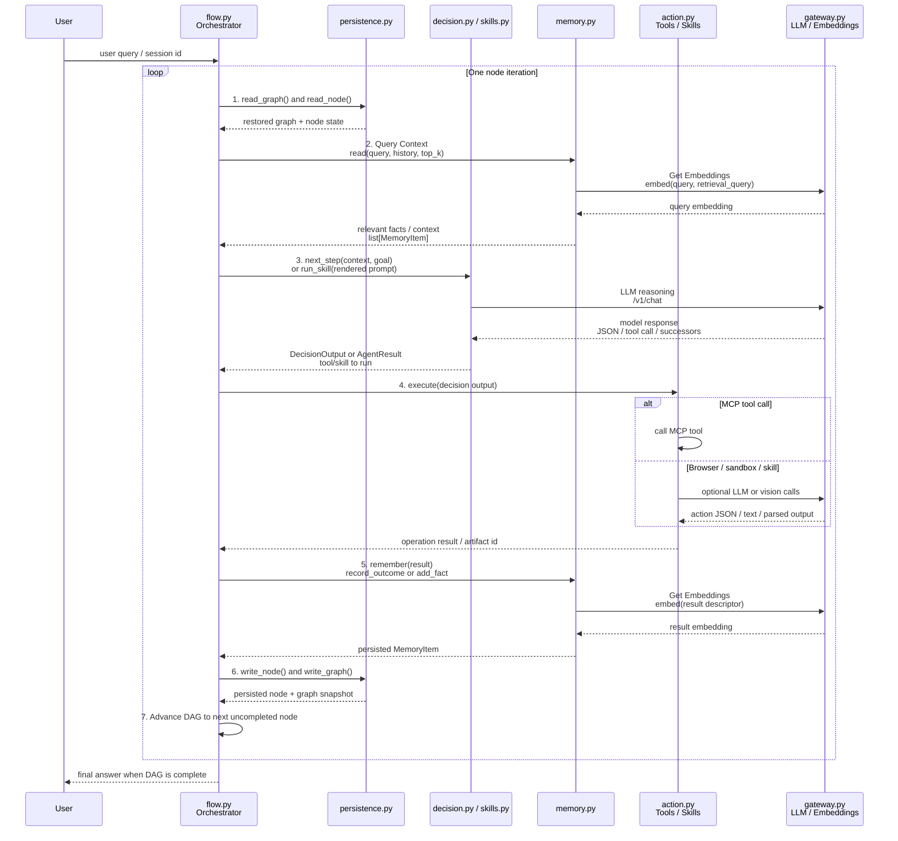

# s9assignment Module Map

This document maps the `s9assignment/code` runtime: what each module owns,
what it takes in, what it returns, and where data moves. The current Session 9
path is the graph orchestrator in `flow.py`; `agent7_s7_carryover.py` is the
older loop-style agent kept for comparison/backward compatibility.

## Big Picture

```text
user query
  |
  v
flow.Executor.run(query)
  |
  +-- memory.read(query)                  -> list[MemoryItem]
  +-- memory.remember(query)              -> MemoryItem
  +-- Graph starts with planner node
  |
  v
skills.run_skill(skill, node_id, graph_nodes, session_id, query, ...)
  |
  +-- normal LLM skill       -> gateway.LLM().chat(...)
  +-- provider-ordered skill -> provider_routing.chat_with_provider_order(...)
  +-- tool-using skill       -> mcp_runner.run_with_tools(...)
  +-- browser skill          -> browser.skill.BrowserSkill.run(...)
  +-- sandbox_executor skill -> sandbox.run_python(...)
  |
  v
AgentResult
  |
  +-- flow.Graph.extend_from(...) may add successors / critics
  +-- persistence.SessionStore writes graph.json and nodes/n_###.json
  +-- formatter AgentResult.output.final_answer becomes final answer
```

Primary typed contracts live in `schemas.py`. Most module boundaries use
Pydantic models instead of free-form dictionaries.

## Mermaid Flow: Component Interaction Map

This diagram mirrors the component roadmap: restore state, gather context,
decide the next operation, execute it, remember the result, persist the node,
then advance the DAG. In the current S9 graph runner, the `decision.py` and
`action.py` boxes from the roadmap correspond mostly to `skills.py` plus
`mcp_runner.py` / `browser.skill` / `sandbox.py`; they are shown as
`decision/skills` and `action/tools/skills` below to keep the roadmap readable.



### Same Roadmap As A Flowchart

```mermaid
flowchart LR
    U[User Query] --> F[flow.py<br/>Orchestrator]

    F -->|1. read_graph + read_node| P[persistence.py]
    P -->|Restore current state| F

    F -->|2. Query Context| M[memory.py]
    M -->|Get Embeddings| G[gateway.py<br/>LLM / Embeddings]
    G -->|Embedding vector| M
    M -->|Relevant facts / context| F

    F -->|3. next_step(context, goal)<br/>or run_skill(prompt)| D[decision.py / skills.py]
    D -->|LLM Reasoning| G
    G -->|DecisionOutput / AgentResult JSON| D
    D -->|Tool or skill to run| F

    F -->|4. execute(decision output)| A[action.py<br/>Tools / Skills]
    A -->|Optional LLM / vision calls| G
    G -->|Model result| A
    A -->|Operation result / artifact id| F

    F -->|5. remember(result)| M
    M -->|Get Embeddings| G
    G -->|Embedding vector| M
    M -->|Persisted memory item| F

    F -->|6. write_node + write_graph| P
    P -->|Persisted snapshot| F

    F -->|7. Advance DAG| NEXT[Next uncompleted node]
    NEXT --> F

    F --> DONE[Final answer when complete]
```

## Runtime State On Disk

| Path | Owner | Contents |
| --- | --- | --- |
| `state/memory.json` | `memory.py` | Persisted `MemoryItem` records. |
| `state/index.faiss`, `state/index_ids.json` | `vector_index.py` | FAISS index and id map for embedded memory. |
| `state/artifacts/` | `artifacts.py` | Content-addressed raw bytes plus JSON metadata. |
| `state/sessions/<sid>/query.txt` | `persistence.py` | Original query for a graph run. |
| `state/sessions/<sid>/graph.json` | `persistence.py` | NetworkX node-link graph snapshot. |
| `state/sessions/<sid>/nodes/n_###.json` | `persistence.py` | Per-node `NodeState`, including exact prompt. |
| `state/sessions/<sid>/browser/` | `browser.skill` | Browser screenshots/legends/turn artifacts. |
| `state/browser_profiles/` | `browser.session` | Optional Playwright storage-state JSON files for reusable authenticated browser sessions. |
| `usage.json` | `mcp_server.py` | Tavily/DDG usage counters. |
| `sandbox/` | `mcp_server.py` | File-tool sandbox and sample papers. |

## S9 Assignment Provider Routing: `provider_routing.py`

| Function | Inputs | Output | Notes |
| --- | --- | --- | --- |
| `estimate_tokens(prompt=None, messages=None, max_tokens=0)` | Prompt/messages plus completion budget. | Integer token estimate. | Same rough char/4 shape as the gateway's rate checks. |
| `choose_provider(provider_order, prompt=None, messages=None, max_tokens=0)` | Ordered providers, prompt/messages. | `ProviderChoice(provider, skipped, note)`. | Reads `llm_gatewayV9 /v1/status` and skips providers in cooldown, RPM, RPD, TPM, backoff, context, or daily-token cap. |
| `chat_with_provider_order(...)` | Normal chat request plus `provider_order`. | Gateway reply dict. | Explicitly pins the selected provider, then retries the remaining ordered providers on retryable gateway failures. |

The Planner sets `provider_order: [gemini, nvidia, groq, cerebras]` in
`agent_config.yaml`, so Gemini remains the preferred Planner model but
saturated Gemini does not trap every Planner call. Other skills use the normal
gateway route; Browser Layer 2b stays pinned to Gemini for stable action loops.

## Core Data Models: `schemas.py`

`schemas.py` is the shared type boundary.

| Model / Function | Inputs | Output / Fields | Used By |
| --- | --- | --- | --- |
| `new_id(prefix="id")` | `prefix: str` | String like `mem:abcd1234`. | Memory, perception. |
| `MemoryItem` | Constructed with memory metadata. | `id`, `kind`, `keywords`, `descriptor`, `value`, optional `artifact_id`, optional `embedding`, `source`, `run_id`, optional `goal_id`, `confidence`, `created_at`. | `memory`, `skills`, `perception`, `decision`. |
| `Artifact` | Raw-byte metadata. | `id`, `content_type`, `size_bytes`, `source`, `descriptor`, `created_at`. | `artifacts`. |
| `Goal` | `id`, `text`. | `done`, optional `attach_artifact_id`. | S7 carryover path. |
| `Observation` | `goals: list[Goal]`. | `.all_done`, `.next_unfinished()`. | S7 carryover path. |
| `ToolCall` | `name: str`, `arguments: dict`. | Tool call payload. | `action`, `memory`, S7 decision. |
| `DecisionOutput` | Optional `answer`, optional `tool_call`. | `.is_answer`. | S7 decision. |
| `NodeSpec` | `skill`, `inputs`, `metadata`. | One graph node to schedule. | Planner outputs, `flow`, `skills`, `browser`. |
| `AgentResult` | Skill execution result. | `success`, `agent_name`, `output`, `artifacts`, `successors`, `cost`, `elapsed_s`, `provider`, optional `error`, optional `error_code`. | Every S8/S9 skill and orchestrator. |
| `BrowserOutput` | Browser result payload. | `url`, `goal`, `path`, `turns`, optional `content`, `actions`, optional `final_url`, optional `profile`, `storage_state_path`, `user_data_dir`, `block_type`. | `browser.skill`. |
| `NodeState` | Persisted node state. | `node_id`, `skill`, `status`, `inputs`, optional `result`, optional `prompt_sent`, timings, `retries`. | `persistence`, `replay`. |

## Current Orchestrator: `flow.py`

### `Graph`

Wrapper around `networkx.DiGraph`.

| Method | Inputs | Output | Notes |
| --- | --- | --- | --- |
| `add_node(skill, inputs, metadata=None)` | Skill name, list of input refs, optional metadata. | Node id like `n:1`. | Adds edges for `n:*` inputs that already exist. |
| `mark(nid, status)` | Node id, status string. | `None`. | Mutates node status. |
| `ready_nodes()` | None. | `list[str]`. | Pending nodes whose predecessors are `complete` or `skipped`. |
| `has_running()` | None. | `bool`. | True if any node is currently running. |
| `extend_from(src_nid, result, registry=...)` | Completed node id, its `AgentResult`, `SkillRegistry`. | `list[str]` new node ids. | Adds dynamic successors, static internal successors, and critic gates for `critic: true` skills. |

Important input-reference rules in `extend_from`:

| Input Form | Meaning |
| --- | --- |
| `n:<label>` | Resolved to a sibling node whose `metadata.label` matches. |
| `n:<number>` | Existing graph node id. |
| bare label | Resolved to sibling label if possible. |
| `USER_QUERY` | The original query. |
| `art:<sha>` | Artifact handle passed through. |
| unknown value | Falls back to parent node id. |
| empty inputs | Legitimate fan-out worker; structural edge added from parent but no data dependency injected. |

### `Executor`

| Method | Inputs | Output | Side Effects |
| --- | --- | --- | --- |
| `__init__(registry=None)` | Optional `SkillRegistry`. | Executor instance. | Calls `ensure_gateway()`. |
| `run(query, session_id=None, resume=False)` | User query, optional session id, resume flag. | Final answer string. | Reads/writes memory, writes session graph/nodes, runs ready nodes concurrently. |
| `_run_one(nid, graph, sid, query, store, memory_hits)` | Node context. | `(nid, AgentResult, rendered_prompt)`. | Persists running state and dispatches `skills.run_skill`. |

Final answer selection:

1. Prefer the latest completed `formatter` node's `output.final_answer`.
2. If none exists, use the last completed node's `AgentResult.output` JSON preview.

## Skill Registry And Dispatch: `skills.py`

`skills.py` turns YAML skill definitions and graph node inputs into actual
execution.

### `Skill`

Constructed from an entry in `agent_config.yaml`.

Fields:

| Field | Source | Meaning |
| --- | --- | --- |
| `name` | YAML key. | Skill/node type. |
| `prompt_path` | `prompt`. | Markdown prompt template. |
| `description` | `description`. | Human-facing description. |
| `tools_allowed` | `tools_allowed`. | MCP tool names allowed for this skill. |
| `internal_successors` | `internal_successors`. | Static child skills added after success. |
| `critic` | `critic`. | Whether outgoing edges get critic-gated. |
| `provider_pin` | `provider_pin`. | Optional gateway provider pin. |
| `temperature` | `temperature`, default `0.3`. | LLM temperature. |
| `max_tokens` | `max_tokens`, default `2048`. | LLM max output. |

### Public Functions

| Function | Inputs | Output | Notes |
| --- | --- | --- | --- |
| `SkillRegistry()` | Reads `agent_config.yaml`. | Registry. | `get(name)` and `names()`. |
| `resolve_inputs(node_inputs, graph_nodes, query)` | Input refs, graph node dict, original query. | `list[dict]`. | Materializes `USER_QUERY`, upstream node outputs, artifact bytes, and literals. |
| `render_prompt(skill, query, resolved, failure_report=None, memory_hits=None, question=None)` | Skill + resolved inputs. | Prompt string. | Adds optional `USER_QUERY`, `QUESTION`, `FAILURE`, `MEMORY HITS`, and `INPUTS` sections. |
| `parse_skill_json(text)` | Raw model text. | `dict`. | Strips fences and extracts one JSON object. |
| `tool_payload(tool_names)` | Allowed tool names. | Gateway tool schema list or `None`. | Catalog includes `web_search`, `fetch_url`, `search_knowledge`. |
| `run_skill(skill, node_id, graph_nodes, session_id, query, failure_report, memory_hits=None)` | Node execution context. | `(AgentResult, rendered_prompt)`. | Main dispatch function. |

### `run_skill` Dispatch Matrix

| Skill Type | Input | Execution | Output |
| --- | --- | --- | --- |
| `sandbox_executor` | Upstream `output.code`. | `sandbox.run_python(code)`. | `AgentResult(success=exit_code==0 and not timed_out, output=sandbox_dict)`. |
| `browser` | Node `metadata.url`/`metadata.goal` or inputs. | `browser.skill.BrowserSkill.run(NodeSpec)`. | Browser `AgentResult`. |
| Tool-using skill | Rendered prompt + tool schemas. | `mcp_runner.run_with_tools(...)`. | Parsed JSON lifted into `AgentResult.output` and `successors`. |
| Text-only skill | Rendered prompt. | `LLM().chat(...)`. | Parsed JSON lifted into `AgentResult.output` and `successors`. |

Malformed `NodeSpec` outputs fail the node loudly instead of being silently
dropped.

## Skill Catalog: `agent_config.yaml`

| Skill | Prompt | Tools | Special Behavior | Output Expectation |
| --- | --- | --- | --- | --- |
| `planner` | `prompts/planner.md` | None | Emits initial/recovery graph. | JSON with `nodes`/`successors`. |
| `retriever` | `prompts/retriever.md` | `search_knowledge` | Queries indexed memory. | Structured JSON for downstream skills. |
| `researcher` | `prompts/researcher.md` | `web_search`, `fetch_url` | Multi-step web research. | Normalized research text/data. |
| `distiller` | `prompts/distiller.md` | None | `critic: true`. | Structured extraction; outgoing edges gated by critic. |
| `summariser` | `prompts/summariser.md` | None | Condenses content. | Summary JSON. |
| `critic` | `prompts/critic.md` | None | Evaluates upstream result. | Verdict JSON consumed by `recovery.handle_critic_verdict`. |
| `formatter` | `prompts/formatter.md` | None | Terminal convention. | `output.final_answer`. |
| `sandbox_executor` | `prompts/sandbox_executor.md` | None | Bypasses LLM, runs code. | Sandbox output dict. |
| `coder` | `prompts/coder.md` | None | Adds static `sandbox_executor` successor. | JSON with `code`. |
| `browser` | `prompts/browser.md` | None | Bypasses normal dispatch; owns cascade. | `BrowserOutput` in `AgentResult.output`. |

## Gateway Bridge: `gateway.py`

Connects agent code to `llm_gatewayV9`.

| Function / Symbol | Inputs | Output | Notes |
| --- | --- | --- | --- |
| `_is_up()` | None. | `bool`. | GETs `http://localhost:8109/v1/routers`. |
| `ensure_gateway()` | None. | `None` or raises. | Starts `llm_gatewayV9` via `uv run main.py` if not already up. |
| `LLM` | Imported dynamically from `llm_gatewayV9/client.py`. | Client class. | Avoids polluting `sys.path`. |
| `embed(text, task_type="retrieval_document")` | Text, task type. | Gateway embed response dict. | Calls `LLM().embed(...)`. |

## Memory And Retrieval

### `memory.py`

Owns persistent semantic memory.

| Function | Inputs | Output | Side Effects |
| --- | --- | --- | --- |
| `read(query, history=None, kinds=None, top_k=8)` | Query text, optional history/kind filter. | `list[MemoryItem]`. | Vector search first, keyword fallback. |
| `remember(raw_text, source, run_id, goal_id=None)` | Free-form text and provenance. | `MemoryItem`. | LLM-classifies, embeds if embeddable, appends to `memory.json`, updates FAISS. |
| `record_outcome(tool_call, result_text, artifact_id, run_id, goal_id)` | Deterministic tool result. | `MemoryItem`. | Writes `tool_outcome`; embeds descriptor. |
| `add_fact(descriptor, value=None, keywords=None, source, run_id, goal_id=None)` | Known fact/document chunk. | `MemoryItem`. | Skips classifier; embeds descriptor. |
| `clear()` | None. | `None`. | Deletes memory JSON and clears FAISS files. |

Memory kinds:

| Kind | Embedded? | Typical Writer |
| --- | --- | --- |
| `fact` | Yes | `remember`, `add_fact`, `index_document`. |
| `preference` | Yes | `remember`. |
| `tool_outcome` | Yes | `record_outcome`. |
| `scratchpad` | No | `remember` classifier. |

### `vector_index.py`

FAISS wrapper for cosine similarity search.

| Method | Inputs | Output |
| --- | --- | --- |
| `VectorIndex(store_dir)` | Directory path. | Loads existing index/id files if present. |
| `add(item_id, embedding)` | Memory id, vector. | `None`; appends vector and id. |
| `search(query_embedding, k=5)` | Query vector, result count. | `list[(item_id, similarity)]`. |
| `persist()` | None. | Writes `index.faiss` and `index_ids.json`. |
| `clear()` | None. | Deletes index files and resets memory. |
| `size` | Property. | Number of indexed vectors. |
| `dim` | Property. | Vector dimension or `None`. |

## Persistence And Replay

### `persistence.py`

| Class / Function | Inputs | Output | Files |
| --- | --- | --- | --- |
| `SessionStore(session_id)` | Session id. | Store object. | Creates `state/sessions/<sid>/nodes`. |
| `write_query(query)` / `read_query()` | Query string / none. | None / query string. | `query.txt`. |
| `write_graph(graph_obj)` | `nx.DiGraph`. | None. | `graph.json` via `nx.node_link_data`. |
| `read_graph()` | None. | `nx.DiGraph | None`. | Restores typed `AgentResult`; legacy pickle fallback. |
| `write_node(state)` | `NodeState`. | None. | `nodes/n_###.json`. |
| `read_node(node_id)` | Node id. | `NodeState | None`. | Reads one node JSON. |
| `read_all_nodes()` | None. | `list[NodeState]`. | Skips corrupt files with warning. |
| `list_sessions()` | None. | `list[str]`. | Lists session directories. |

### `replay.py`

CLI for inspecting a persisted run.

| Function | Inputs | Output |
| --- | --- | --- |
| `replay(session_id)` | Session id. | Exit code int. |
| `main()` | CLI args. | Exit code int. |

Interactive keys: enter/`n` next, `p` print prompt, `o` print output, `q` quit.

## MCP Tooling

### `mcp_server.py`

Runs an MCP stdio server with search, fetch, file, and memory-indexing tools.

| Tool | Inputs | Output |
| --- | --- | --- |
| `web_search(query, max_results=5)` | Search query, capped result count. | `list[dict]` with `title`, `url`, `snippet`. |
| `fetch_url(url, timeout=20)` | URL. | Dict with `status`, `content_type`, `length_bytes`, `text`. |
| `get_time(timezone="UTC")` | IANA timezone. | Dict with ISO time, human time, timezone, offset. |
| `currency_convert(amount, from_currency, to_currency)` | Amount and ISO currency codes. | Dict with amount/rate/converted/date/source. |
| `read_file(path)` | Sandbox-relative path. | Dict with path, size, content, encoding. |
| `list_dir(path=".")` | Sandbox-relative directory. | Dict with count, names, entries. |
| `create_file(path, content)` | Sandbox path and text. | Dict describing created file. |
| `update_file(path, content)` | Sandbox path and replacement text. | Dict describing updated file. |
| `edit_file(path, find, replace, replace_all=False)` | Sandbox path and edit spec. | Dict with replacements and updated size. |
| `index_document(path, chunk_size=400, overlap=80)` | Sandbox path or artifact id. | Dict with source, chunks indexed, memory ids. |
| `search_knowledge(query, k=5)` | Query, count. | `list[dict]` memory hits. |

Private helpers:

| Helper | Purpose |
| --- | --- |
| `_safe(path)` | Prevents file tools from escaping `sandbox/`. |
| `_load_usage`, `_save_usage`, `_bump`, `_under_cap` | Search usage accounting. |
| `_tavily_search`, `_ddg_search` | Web search backends. |
| `_crawl4ai_fetch` | Browser-backed markdown fetch. |
| `_read_for_index`, `_chunk_text` | Document indexing support. |

### `mcp_runner.py`

Tool-use loop for skills that allow MCP tools.

| Function | Inputs | Output |
| --- | --- | --- |
| `run_with_tools(prompt, tools_payload, agent, session_id, provider_pin=None, max_tokens=2048, temperature=0.3)` | Prompt, gateway tool schemas, agent/session metadata. | Final gateway reply dict. |
| `_dispatch_tool(session, name, args)` | MCP session, tool name, args. | Tool result text. |
| `_chat(messages, tools, agent, session_id, provider_pin, max_tokens, temperature)` | Gateway chat request pieces. | Gateway response dict. |

Flow:

```text
prompt -> gateway chat(tools=...) -> tool_calls?
  | yes: call MCP tool, append tool result message, repeat
  | no: return final response dict
```

### `action.py`

Older S7 dispatcher, still useful conceptually.

| Function | Inputs | Output |
| --- | --- | --- |
| `_result_to_text(result)` | MCP `CallToolResult`. | Joined text string. |
| `execute(session, tool_call)` | MCP session and `ToolCall`. | `(descriptor_text, artifact_id_or_None)`. |

Large outputs over 4096 bytes are written to `artifacts.py` and represented
by an `art:*` handle.

## Browser Package

### `browser/client.py`

Framework-free async HTTP client for `llm_gatewayV9`.

| Item | Inputs | Output |
| --- | --- | --- |
| `GatewayResult` | Normalized gateway response fields. | Dataclass with `parsed`, `text`, `provider`, `model`, `latency_ms`, token counts. |
| `V9Client(base_url, agent, timeout, session)` | Gateway settings. | Client object. |
| `vision(image_data_url, prompt, schema=None, ...)` | Image data URL and prompt. | `GatewayResult`; POST `/v1/vision`. |
| `chat(prompt, schema=None, ...)` | Text prompt. | `GatewayResult`; POST `/v1/chat`. |
| `cost_by_agent(agent=None, session=None)` | Optional filters. | Ledger dict; GET `/v1/cost/by_agent`. |

`VisionResult` and `V9VisionClient` are compatibility aliases.

### `browser/dom.py`

DOM accessibility/interaction enumeration.

| Item | Inputs | Output |
| --- | --- | --- |
| `Element` | id, tag, role, name, box. | `.cx`, `.cy`, `.legend_line()`. |
| `PageSnapshot` | elements, DPR, viewport. | `.by_id(mark)`, `.legend(max_chars=40000)`. |
| `enumerate_interactives(page)` | Playwright `Page`. | `PageSnapshot`. |

### `browser/highlight.py`

Pillow screenshot annotation.

| Function | Inputs | Output |
| --- | --- | --- |
| `annotate(screenshot_png, elements, dpr)` | PNG bytes, `Element`s, device pixel ratio. | Annotated PNG bytes. |
| `to_data_url(png_bytes)` | PNG bytes. | `data:image/png;base64,...` string. |

### `browser/driver.py`

Layer 2b and Layer 3 browser drivers.

| Item | Inputs | Output |
| --- | --- | --- |
| `StepRecord` | Turn metadata, actions, outcome, provider/model, latency/tokens. | One browser-control turn record. |
| `DriverConfig` | `goal`, step/failure caps, artifact dir, pause, provider/model pins. | Driver config. |
| `DriverResult` | success, note, steps. | Result from a browser driver. |
| `_dispatch(action, page, snap)` | Action JSON, Playwright page, snapshot. | Outcome string. |
| `BaseDriver(page, client, config)` | Browser page, `V9Client`, config. | Driver instance. |
| `BaseDriver.run()` | None. | `DriverResult`. |
| `A11yDriver` | Text/a11y prompt path. | Uses `V9Client.chat`. |
| `SetOfMarksDriver` | Vision set-of-marks path. | Uses screenshots + `V9Client.vision`. |

Action schema supports browser actions like click/fill/key/wait/scroll/done
as JSON emitted by the model.

### `browser/skill.py`

Session 9 browser cascade wrapper.

| Function / Method | Inputs | Output |
| --- | --- | --- |
| `detect_gateway_block(html)` | HTML string. | Block marker string or `None`. |
| `_fetch_html(url, timeout=30.0)` | URL. | `(html, final_url)`. |
| `_extract(html)` | HTML. | Main text string via `trafilatura`. |
| `_is_useful_extract(content, goal)` | Extracted text and goal. | `bool`. |
| `BrowserSkill(...).run(node)` | `NodeSpec` with `metadata.url`, `metadata.goal`, optional `selectors`, optional `force_path`. | `AgentResult` with `BrowserOutput`. |

Cascade:

```text
Layer 1: bare HTTP + trafilatura extract
  -> if useful, return path="extract"
Layer 2a: caller-supplied deterministic selectors
  -> if successful, return path="deterministic"
Layer 2b: Playwright + accessibility text driver
  -> if successful, return path="a11y"
Layer 3: Playwright + screenshot set-of-marks vision driver
  -> if successful, return path="vision"
else -> AgentResult(success=False, error_code="interaction_failed" or "gateway_blocked")
```

## Sandbox And Artifacts

### `sandbox.py`

| Function | Inputs | Output |
| --- | --- | --- |
| `run_python(code, timeout_s=30, stdout_cap=1_000_000, stderr_cap=1_000_000, env_whitelist=..., extra_env=None)` | Python source string and limits. | Dict with `exit_code`, `stdout`, truncation flags, `stderr`, `files_written`, `timed_out`, `cwd`. |

This is usability isolation, not security isolation.

### `artifacts.py`

| Function | Inputs | Output |
| --- | --- | --- |
| `put(blob, content_type, source, descriptor)` | Raw bytes and metadata. | Artifact id like `art:abcd...`. |
| `get_bytes(artifact_id)` | Artifact id. | Raw bytes. |
| `get_meta(artifact_id)` | Artifact id. | `Artifact`. |
| `exists(artifact_id)` | Artifact id. | `bool`. |

Artifacts are content-addressed by SHA-256 prefix and stored under
`state/artifacts`.

## Recovery

### `recovery.py`

| Function / Class | Inputs | Output | Notes |
| --- | --- | --- | --- |
| `classify_failure(error_text)` | Error string. | `RecoveryReason`. | Heuristic categories for transient, validation, upstream, etc. |
| `RecoveryDecision` | `action`, `reason`, `note`, optional `failure_report`. | Dataclass. | Action is `skip` or `replan`. |
| `plan_recovery(failed_skill, error_text, failed_node_id)` | Failed node info. | `RecoveryDecision`. | Planner failures and transient/validation errors skip; genuine upstream failures replan. |
| `handle_critic_verdict(nid, result, graph, recovered_branches, cap_hit)` | Critic node result and graph. | `bool`: handled/spliced or not. | On critic fail, inserts recovery planner and skips rejected child; caps repeated recovery. |

## Older S7 Loop Path

These modules are still present but are not the current S9 graph runner.

### `agent7_s7_carryover.py`

| Function | Inputs | Output |
| --- | --- | --- |
| `_mcp_tools_for_decision(tools)` | MCP tool descriptors. | Gateway-compatible tool schema list. |
| `run(query)` | User query. | Final answer string. |
| `main()` | CLI args. | None. |

Loop:

```text
memory.read -> perception.observe -> decision.next_step -> action.execute
  -> memory.record_outcome -> repeat until goals done
```

### `perception.py`

| Function / Model | Inputs | Output |
| --- | --- | --- |
| `_GoalDelta` | LLM output schema. | Text/done/artifact attachment hints. |
| `_PerceptionOutput` | LLM output schema. | List of goal deltas. |
| `observe(query, hits, history, prior_goals, run_id)` | User query, memory hits, history, prior goals, run id. | `Observation`. |

### `decision.py`

| Function | Inputs | Output |
| --- | --- | --- |
| `next_step(goal, hits, attached, history, mcp_tools)` | Current goal, memory, raw attached artifacts, history, available tools. | `DecisionOutput`. |

`DecisionOutput` is either an answer or a single MCP `ToolCall`.

## Tests

| Test Module | Purpose |
| --- | --- |
| `tests/test_critic_autoinsert.py` | Verifies `Graph.extend_from` splices critic nodes correctly. |
| `tests/test_recovery.py` | Verifies failure classification and critic-fail recovery behavior. |
| `tests/test_recovery_amnesia.py` | Verifies recovery planner reuses prior completed siblings. |
| `tests/test_natural_vision_search.py` | Browser/vision integration smoke-style script. |
| `test_mcp_server.py` | MCP server tool tests, including sandbox file safety. |

## Prompt Files

Prompt files under `prompts/` are part of the runtime contract. They define
the JSON shape each LLM-backed skill is expected to emit. The Python side
does not have per-skill classes for most skills; `agent_config.yaml` plus the
prompt file are the skill definition.

| Prompt | Skill |
| --- | --- |
| `prompts/planner.md` | `planner` |
| `prompts/retriever.md` | `retriever` |
| `prompts/researcher.md` | `researcher` |
| `prompts/distiller.md` | `distiller` |
| `prompts/summariser.md` | `summariser` |
| `prompts/critic.md` | `critic` |
| `prompts/formatter.md` | `formatter` |
| `prompts/sandbox_executor.md` | `sandbox_executor` |
| `prompts/coder.md` | `coder` |
| `prompts/browser.md` | `browser` |

## Main Entry Points

| Command | Meaning |
| --- | --- |
| `uv run python flow.py "question"` | Run the current S8/S9 graph orchestrator. |
| `uv run python replay.py <session_id>` | Inspect a persisted graph run. |
| `python mcp_server.py` | Start the MCP stdio server directly. |
| `uv run python agent7_s7_carryover.py "question"` | Run the older S7 loop agent. |
| `../run_demo.sh hello` | Demo wrapper from `S9SharedCode/`. |
