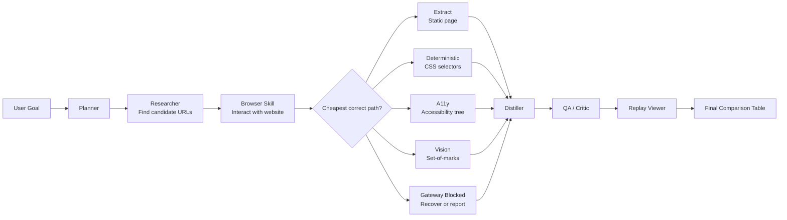

# Project X Module Map

Project X is a thin comparison-agent layer over `S9SharedCode/code`.
It does not modify `flow.py`; it plugs in through a project skill catalogue,
project prompts, and replay/report tooling.

## Flow

## Files

| File | Role |
| --- | --- |
| `compare_agent.py` | CLI runner. Creates a session, runs `flow.Executor` with `ProjectSkillRegistry`, then writes a replay report. |
| `project_registry.py` | S9-style skill catalogue loader for `projectx/agent_config.yaml`. |
| `agent_config.yaml` | Project catalogue. Reuses S9 skills and overrides prompts for Planner, Researcher, Distiller, Critic, and Formatter. |
| `prompts/planner.md` | Emits the initial Researcher node for comparison requests. |
| `prompts/researcher.md` | Finds candidate URLs and emits Browser successors using S9's existing `successors` contract. |
| `prompts/distiller.md` | Turns Browser evidence into normalized comparison records. |
| `prompts/formatter.md` | Renders the final comparison table. |
| `replay_report.py` | Reads persisted S9 session state and writes the eight-section Markdown replay report. |
| `browser_report.py` | Small helpers for Browser path normalization and visible action counts. |
| `llm_delay.py` | Project-local provider pins for S9 text skills and Browser chat/vision calls, with optional debug delay. |
| `run.sh` | Runs the Project X CLI inside the existing S9 `uv` environment. |

## Alignment With S9

- Uses `flow.Executor` unchanged.
- Uses `Graph.extend_from(...)` unchanged for dynamic Researcher successors.
- Uses existing `browser` skill dispatch in `S9SharedCode/code/skills.py`.
- Uses existing Browser cascade in `S9SharedCode/code/browser/skill.py`.
- Uses existing `SessionStore` and node JSON files for replay input.
