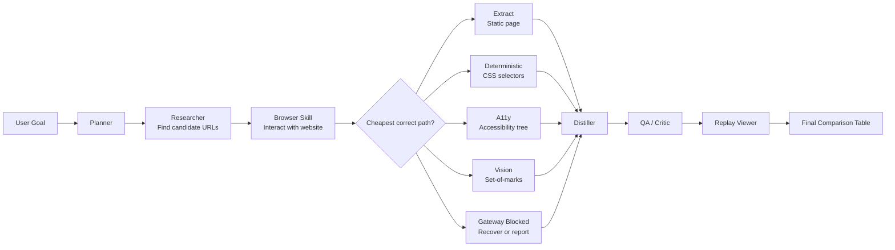

# General Browser Comparison Agent

## Summary

Build a reusable browser-capable comparison flow that accepts the user's
comparison query at runtime, drives the right web workflow, and produces both
a final comparison table and a replay/report. Do not modify `flow.py`; all
behavior plugs in through a project-level skill catalogue, a Browser bridge
extension pattern, prompts, and replay tooling.

## Key Changes

- Keep implementation files under `projectx/`.
- Reuse the existing Session 9 runtime and Browser skill.
- Add a project runner that supplies a local skill catalogue to the existing
  `Executor` instead of editing the orchestrator.
- Use catalogue-driven Researcher successors for every comparison:
  Planner emits Researcher; Researcher discovers candidate URLs and emits
  Browser successor nodes, followed by Distiller and Formatter nodes. This
  uses the existing S9 `successors` contract and keeps `flow.py` unchanged.
- Extend replay/report tooling to generate a Markdown report with:
  1. Original user goal
  2. Planner DAG
  3. Browser path chosen: `extract`, `deterministic`, `a11y`, `vision`, or
     `blocked`
  4. Browser actions taken
  5. Screenshots or page-state logs
  6. Extracted data
  7. Final comparison table
  8. Turn count and cost summary

## Routing Shape

All comparison prompts follow:

`User Goal -> Planner -> Researcher -> Browser Skill -> cheapest correct path -> Distiller -> Critic -> Replay Viewer -> Final Comparison Table`

Browser's cheapest-correct-path cascade is:

`extract -> deterministic -> a11y -> vision -> blocked`

## Acceptance Prompts

- `Compare 3 laptops under ₹80,000.`
  - Expected route: Researcher selects Croma's laptop category, Browser drives
    the listing/filter/product-card workflow.
- `Compare top 3 Hugging Face text-generation models sorted by likes.`
  - Expected route: Researcher selects Hugging Face models, Browser drives
    filter/sort/model-card workflow.
- `Compare 5 AI coding tools by free plan and paid plan.`
  - Expected route: Researcher finds candidate official/pricing URLs;
    Browser inspects dynamic pricing pages where useful.
- `Compare 5 CNC/VMC training institutes in Bangalore.`
  - Expected route: Researcher finds candidate URLs/listings;
    Browser inspects pages/forms/tabs where useful.

## Test Plan

- Unit tests:
  - Browser path normalization maps `gateway_blocked` to `blocked`.
  - Visible action counter excludes passive `wait` and `done`.
  - Replay report renders from synthetic session data.
- Prompt regression checks:
  - All four prompts route Planner -> Researcher.
  - Researcher output emits Browser successors, plus Distiller and Formatter.
- Live smoke runs:
  - Run all four acceptance prompts.
  - Confirm each produces a comparison table.
  - Confirm every Browser run records path, actions, screenshots/logs,
    extracted data, turns, and cost.
  - If a site blocks automation, replay must show `blocked` clearly rather
    than inventing data.

## Assumptions

- The comparison query remains user-supplied; no task is hardcoded into the
  orchestrator.
- `flow.py` remains unchanged.
- Existing gateway cost endpoint `/v1/cost/by_agent?session=<sid>` is the
  source of cost data.
- Live web data may change; reports reflect the exact captured run.
